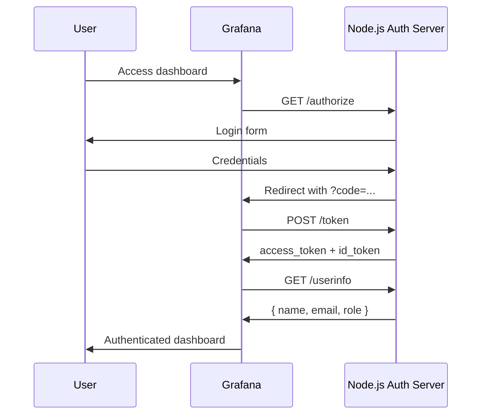

# Grafana OAuth2 — Node.js OIDC Integration

<p align="center">
  
  
  
  
  
</p>

A working example of **wiring Grafana's built-in OAuth2/OIDC authentication to a custom Node.js authorization server**. Log in to Grafana with your own identity provider — no third-party SSO required.

---

## 🔑 How It Works



---

## 🚀 Quick Start

```bash
docker-compose up
```

Then open **http://localhost:3000** (Grafana) and click **Sign in with OAuth**.

---

## ⚙️ Grafana Config (`grafana.ini`)

```ini
[auth.generic_oauth]
enabled = true
name = MyAuthServer
client_id = grafana-client
client_secret = secret
scopes = openid profile email
auth_url = http://localhost:4000/authorize
token_url = http://localhost:4000/token
api_url = http://localhost:4000/userinfo
```

---

## 📁 Structure

```
├── auth-server/          # Node.js OIDC provider
│   ├── index.js
│   └── routes/
├── grafana/
│   └── grafana.ini       # OAuth config
└── docker-compose.yml
```

---

## 📄 License

MIT
